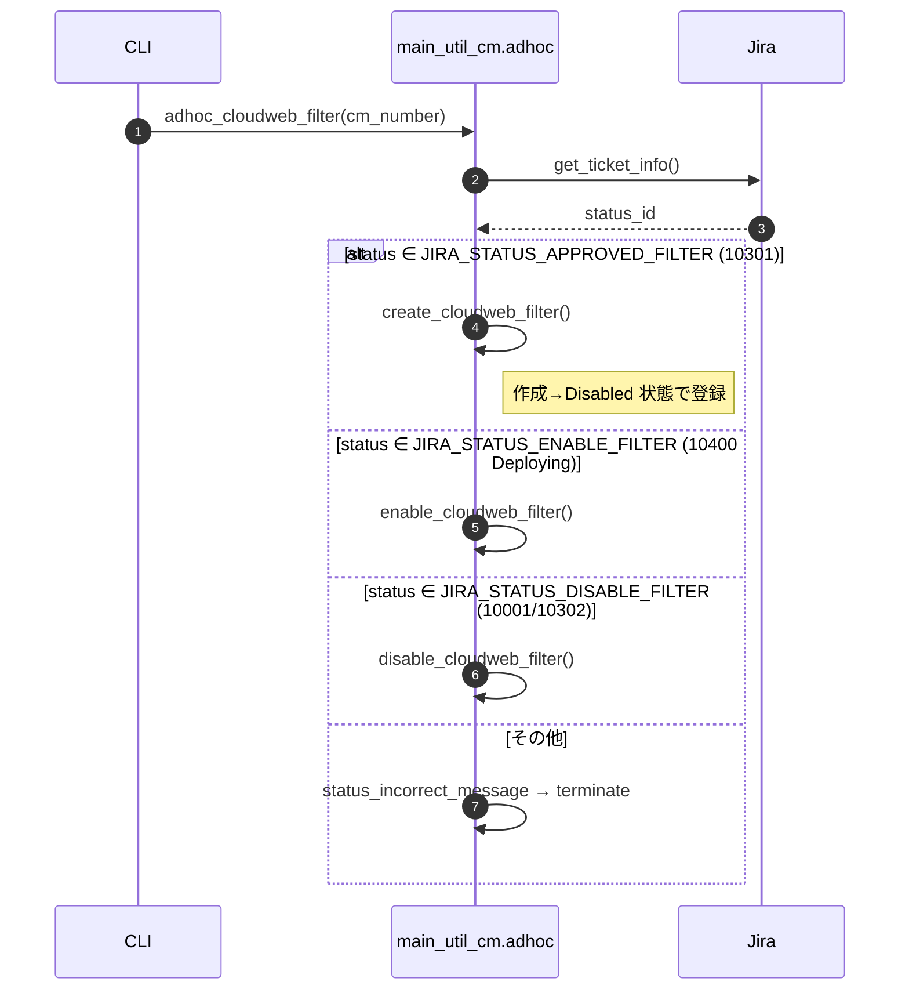

```mermaid
sequenceDiagram
    autonumber
    participant CLI
    participant CM as main_util_cm.adhoc
    participant Jira

    CLI->>CM: adhoc_cloudweb_filter(cm_number)
    CM->>Jira: get_ticket_info()
    Jira-->>CM: status_id

    alt status ∈ JIRA_STATUS_APPROVED_FILTER (10301)
        CM->>CM: create_cloudweb_filter()
        Note right of CM: 作成→Disabled 状態で登録
    else status ∈ JIRA_STATUS_ENABLE_FILTER (10400 Deploying)
        CM->>CM: enable_cloudweb_filter()
    else status ∈ JIRA_STATUS_DISABLE_FILTER (10001/10302)
        CM->>CM: disable_cloudweb_filter()
    else その他
        CM->>CM: status_incorrect_message → terminate
    end
```
```
