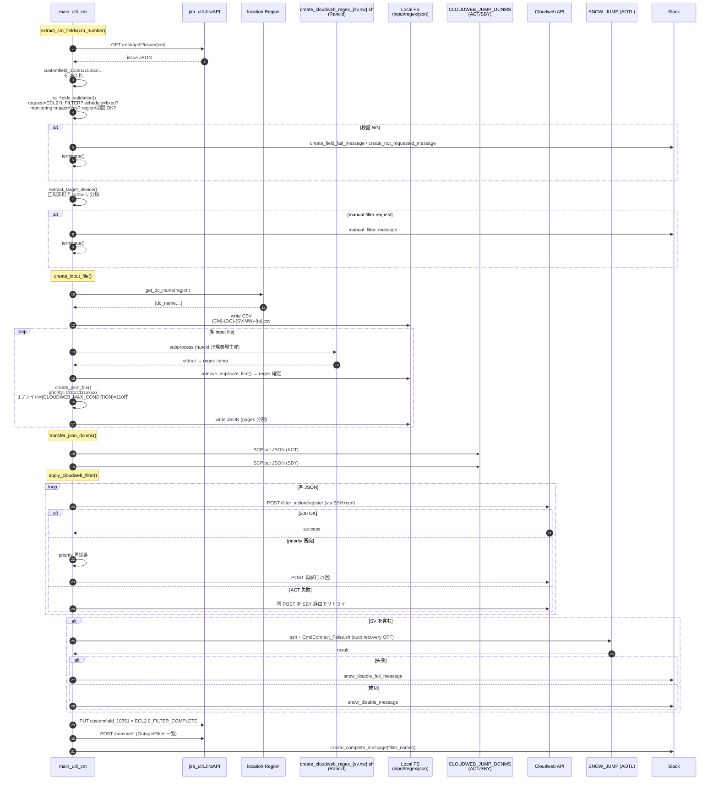

```mermaid
sequenceDiagram
    autonumber
    participant CM as main_util_cm
    participant Jira as jira_util.JiraAPI
    participant Loc as location.Region
    participant Sh as create_cloudweb_regex_{sv,nw}.sh<br/>(Rancid)
    participant FS as Local FS<br/>(input/regex/json)
    participant DCNMS as CLOUDWEB_JUMP_DCNMS<br/>(ACT/SBY)
    participant CW as Cloudweb API
    participant SNOW as SNOW_JUMP (AOTL)
    participant Slack

    Note over CM: extract_cm_fields(cm_number)
    CM->>Jira: GET /rest/api/2/issue/{cm}
    Jira-->>CM: issue JSON
    CM->>CM: customfield_10351/10353/...<br/>を dict 化

    CM->>CM: jira_fields_validation()<br/>request=ECL2.0_FILTER? schedule=fixed?<br/>monitoring impact=Yes? region/期間 OK?
    alt 検証 NG
        CM->>Slack: create_field_fail_message / create_not_requested_message
        CM-->>CM: terminate()
    end

    CM->>CM: extract_target_device()<br/>正規表現で sv/nw に分類
    alt manual filter request
        CM->>Slack: manual_filter_message
        CM-->>CM: terminate()
    end

    Note over CM: create_input_file()
    CM->>Loc: get_dc_name(region)
    Loc-->>CM: [dc_name,...]
    CM->>FS: write CSV<br/>{CM}-{DC}-{SV|NW}-{ts}.csv

    loop 各 input file
        CM->>Sh: subprocess (rancid 正規表現生成)
        Sh-->>CM: stdout → regex .temp
        CM->>FS: remove_duplicate_line() → regex 確定
        CM->>CM: create_json_file()<br/>priority=1110/1111xxxxx<br/>1ファイル={CLOUDWEB_MAX_CONDITION}=110件
        CM->>FS: write JSON (pages 分割)
    end

    Note over CM: transfer_json_dcnms()
    CM->>DCNMS: SCP put JSON (ACT)
    CM->>DCNMS: SCP put JSON (SBY)

    Note over CM: apply_cloudweb_filter()
    loop 各 JSON
        CM->>CW: POST /filter_action/register (via SSH+curl)
        alt 200 OK
            CW-->>CM: success
        else priority 衝突
            CM->>CM: priority 再採番
            CM->>CW: POST 再試行 (1回)
        else ACT 失敗
            CM->>CW: 同 POST を SBY 経由でリトライ
        end
    end

    alt SV を含む
        CM->>SNOW: ssh + CmdConnect_False.sh (auto recovery OFF)
        SNOW-->>CM: result
        alt 失敗
            CM->>Slack: snow_disable_fail_message
        else 成功
            CM->>Slack: snow_disable_message
        end
    end

    CM->>Jira: PUT customfield_10351 = ECL2.0_FILTER_COMPLETE
    CM->>Jira: POST /comment (Outage/Filter 一覧)
    CM->>Slack: create_complete_message(filter_names)
```
```
