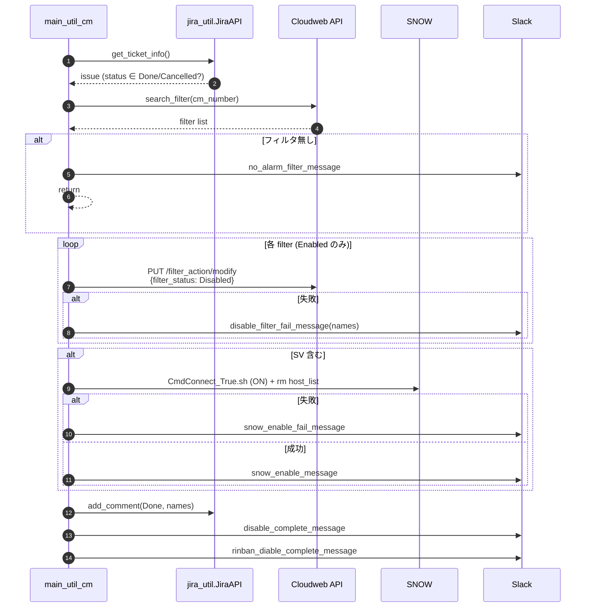

```mermaid
sequenceDiagram
    autonumber
    participant CM as main_util_cm
    participant Jira as jira_util.JiraAPI
    participant CW as Cloudweb API
    participant SNOW
    participant Slack

    CM->>Jira: get_ticket_info()
    Jira-->>CM: issue (status ∈ Done/Cancelled?)
    
    CM->>CW: search_filter(cm_number)
    CW-->>CM: filter list

    alt フィルタ無し
        CM->>Slack: no_alarm_filter_message
        CM-->>CM: return
    end

    loop 各 filter (Enabled のみ)
        CM->>CW: PUT /filter_action/modify<br/>{filter_status: Disabled}
        alt 失敗
            CM->>Slack: disable_filter_fail_message(names)
        end
    end

    alt SV 含む
        CM->>SNOW: CmdConnect_True.sh (ON) + rm host_list
        alt 失敗
            CM->>Slack: snow_enable_fail_message
        else 成功
            CM->>Slack: snow_enable_message
        end
    end

    CM->>Jira: add_comment(Done, names)
    CM->>Slack: disable_complete_message
    CM->>Slack: rinban_diable_complete_message
```
```
