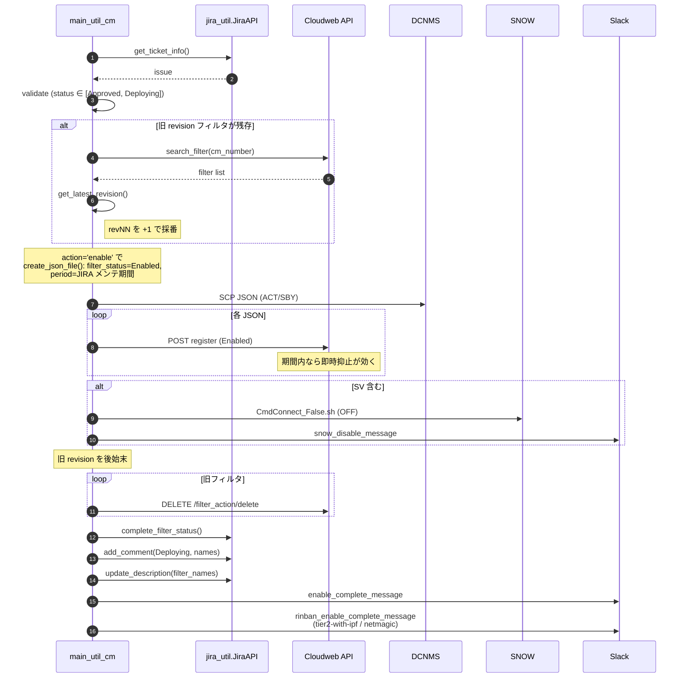

```mermaid
sequenceDiagram
    autonumber
    participant CM as main_util_cm
    participant Jira as jira_util.JiraAPI
    participant CW as Cloudweb API
    participant DCNMS
    participant SNOW
    participant Slack

    CM->>Jira: get_ticket_info()
    Jira-->>CM: issue
    CM->>CM: validate (status ∈ [Approved, Deploying])

    alt 旧 revision フィルタが残存
        CM->>CW: search_filter(cm_number)
        CW-->>CM: filter list
        CM->>CM: get_latest_revision()
        Note right of CM: revNN を +1 で採番
    end

    Note over CM: action='enable' で<br/>create_json_file(): filter_status=Enabled,<br/>period=JIRA メンテ期間
    CM->>DCNMS: SCP JSON (ACT/SBY)
    loop 各 JSON
        CM->>CW: POST register (Enabled)
        Note over CW: 期間内なら即時抑止が効く
    end

    alt SV 含む
        CM->>SNOW: CmdConnect_False.sh (OFF)
        CM->>Slack: snow_disable_message
    end

    Note over CM: 旧 revision を後始末
    loop 旧フィルタ
        CM->>CW: DELETE /filter_action/delete
    end

    CM->>Jira: complete_filter_status()
    CM->>Jira: add_comment(Deploying, names)
    CM->>Jira: update_description(filter_names)
    CM->>Slack: enable_complete_message
    CM->>Slack: rinban_enable_complete_message<br/>(tier2-with-ipf / netmagic)
```
```
