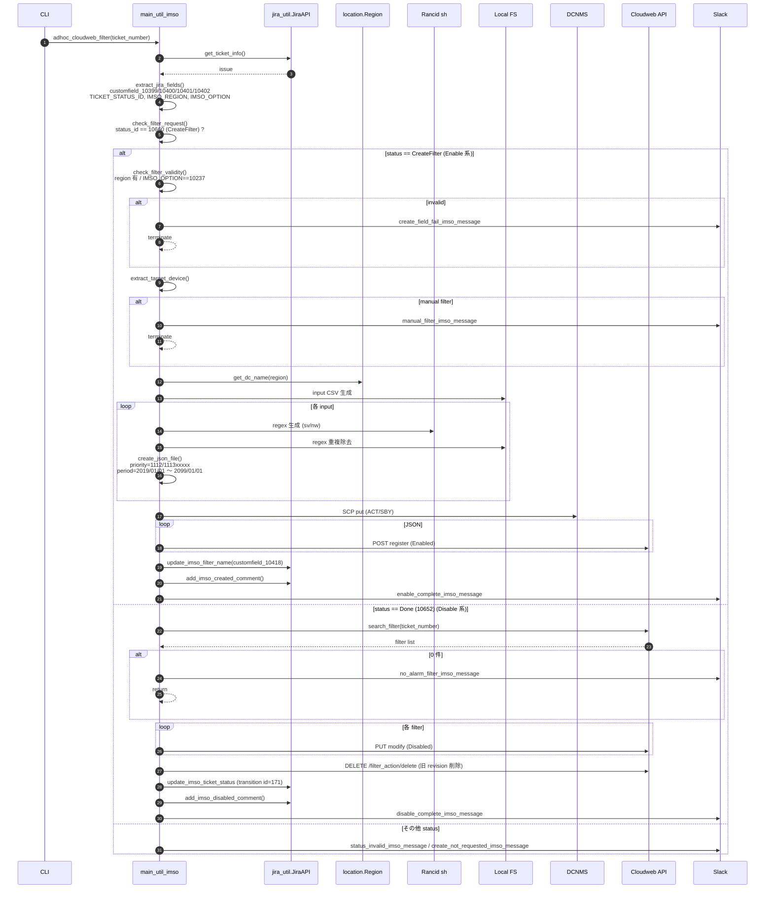

```mermaid
sequenceDiagram
    autonumber
    participant CLI
    participant IM as main_util_imso
    participant Jira as jira_util.JiraAPI
    participant Loc as location.Region
    participant Sh as Rancid sh
    participant FS as Local FS
    participant DCNMS
    participant CW as Cloudweb API
    participant Slack

    CLI->>IM: adhoc_cloudweb_filter(ticket_number)
    IM->>Jira: get_ticket_info()
    Jira-->>IM: issue
    IM->>IM: extract_jira_fields()<br/>customfield_10399/10400/10401/10402<br/>TICKET_STATUS_ID, IMSO_REGION, IMSO_OPTION

    IM->>IM: check_filter_request()<br/>status_id == 10660 (CreateFilter) ?

    alt status == CreateFilter (Enable 系)
        IM->>IM: check_filter_validity()<br/>region 有 / IMSO_OPTION==10237
        alt invalid
            IM->>Slack: create_field_fail_imso_message
            IM-->>IM: terminate
        end

        IM->>IM: extract_target_device()
        alt manual filter
            IM->>Slack: manual_filter_imso_message
            IM-->>IM: terminate
        end

        IM->>Loc: get_dc_name(region)
        IM->>FS: input CSV 生成
        loop 各 input
            IM->>Sh: regex 生成 (sv/nw)
            IM->>FS: regex 重複除去
            IM->>IM: create_json_file()<br/>priority=1112/1113xxxxx<br/>period=2019/01/01 〜 2099/01/01
        end

        IM->>DCNMS: SCP put (ACT/SBY)
        loop JSON
            IM->>CW: POST register (Enabled)
        end

        IM->>Jira: update_imso_filter_name(customfield_10418)
        IM->>Jira: add_imso_created_comment()
        IM->>Slack: enable_complete_imso_message

    else status == Done (10652) (Disable 系)
        IM->>CW: search_filter(ticket_number)
        CW-->>IM: filter list
        alt 0 件
            IM->>Slack: no_alarm_filter_imso_message
            IM-->>IM: return
        end
        loop 各 filter
            IM->>CW: PUT modify (Disabled)
        end
        IM->>CW: DELETE /filter_action/delete (旧 revision 削除)
        IM->>Jira: update_imso_ticket_status (transition id=171)
        IM->>Jira: add_imso_disabled_comment()
        IM->>Slack: disable_complete_imso_message

    else その他 status
        IM->>Slack: status_invalid_imso_message / create_not_requested_imso_message
    end
```
```
