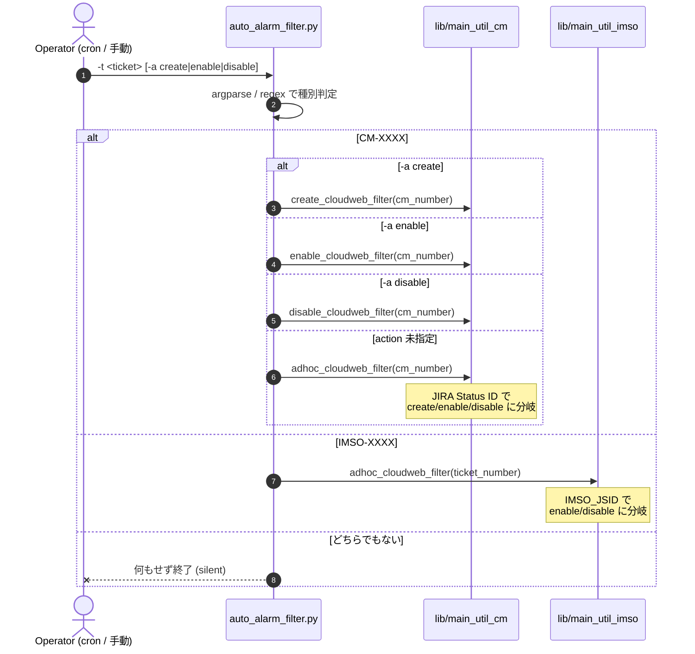

```mermaid
sequenceDiagram
    autonumber
    actor User as Operator (cron / 手動)
    participant CLI as auto_alarm_filter.py
    participant CM as lib/main_util_cm
    participant IMSO as lib/main_util_imso

    User->>CLI: -t <ticket> [-a create|enable|disable]
    CLI->>CLI: argparse / regex で種別判定

    alt CM-XXXX
        alt -a create
            CLI->>CM: create_cloudweb_filter(cm_number)
        else -a enable
            CLI->>CM: enable_cloudweb_filter(cm_number)
        else -a disable
            CLI->>CM: disable_cloudweb_filter(cm_number)
        else action 未指定
            CLI->>CM: adhoc_cloudweb_filter(cm_number)
            Note over CM: JIRA Status ID で<br/>create/enable/disable に分岐
        end
    else IMSO-XXXX
        CLI->>IMSO: adhoc_cloudweb_filter(ticket_number)
        Note over IMSO: IMSO_JSID で<br/>enable/disable に分岐
    else どちらでもない
        CLI--xUser: 何もせず終了 (silent)
    end
```
